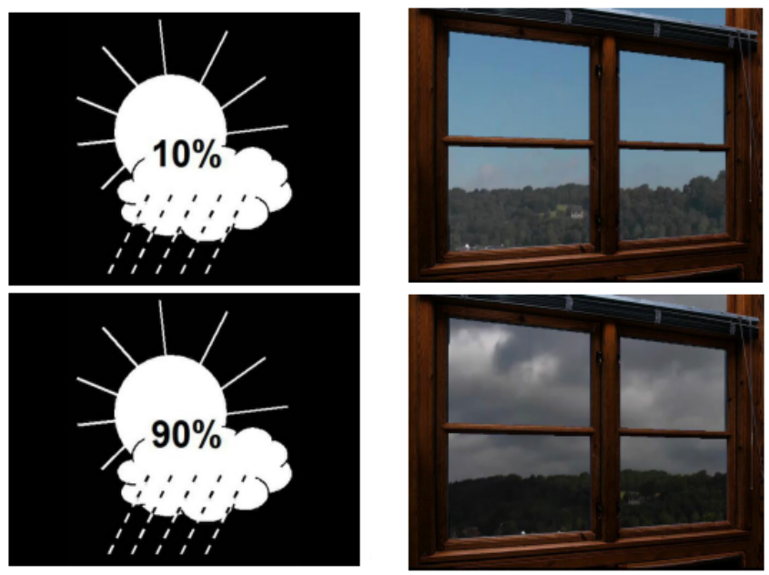
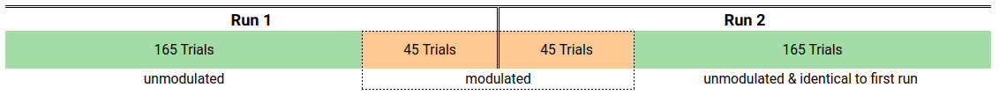

```{r init, message=FALSE}
# load required packages (and then some)
library(tidyverse)
library(afex)
library(emmeans)
library(brms)
library(rstan)
# library(ggmcmc)

# make myself feel at home
theme_set(hrbrthemes::theme_ipsum_rc())
knitr::opts_chunk$set(out.width = "100%")

# set options
options(mc.cores = parallel::detectCores())
rstan_options(auto_write = TRUE)
afex_options(emmeans_model = "multivariate") # as advised by the author for repeated measurements
```

# Introduction & Outline

In my bachelors thesis I helped planning and then conducted and analyzed a decision making (DM) experiment. There are at least two major paradigms present in DM: the _heuristics and biases_ based off Kahnemann & Tversky's research and Gerd Gigerenzers _adaptive toolbox_. It's impossible to honor the vast body of research and knowledge coming from these when summarising them in only one or two sentences, but for brevity's sake: The first paradigm states humans are making decisions by 


# The "Rain and Brain" experiment

In the _Rain and Brain_ experiment participants are presented ambiguous information in a relatable (that is, ecologically valid) setting based on which they have to make a decision. The first information is a numerical chance of rain, the second is "a view out the window" depicting varying degrees of cloudyness. Based on these, the participant had to decide on whether to take an umbrella with them or not.  

```{r stim_examples, out.width="50%", echo=FALSE, fig.cap="Examples of presented stimuli."}

```


Further, in this iteration of the experiment, after every decision the participants were shown a short video clip about how the day turned out: either a sunny or rainy day. The introduction of feedback to the experiment allowed for experimental modulation:  
The first and last third of the experimental trials of stimuli/decision/feedback combinations were identical and consisted of congruent forecast/sky trials (low forecast percentages & rather clear sky, or high percentage and rather cloudy sky) with accurate feedback (it actually "rained" on 20% of the trials with a 20% forecast with rather blue sky). The second third, though, showed the complete range of weather forecasts, but only ambiguous sky-pictures and also gave rainy feedback in 90% of the trials regardless, aiming to increase participants confidence in the sky-pictures.



An earlier iteration of the Rain and Brain experiment showed that people tend to place more weight on either one of the given informations. Or put otherwise: their strategies relied on either following their guts and rely on the sky pictures or they rather placed their trust in the "hard facts" implied by a numerical forecast. The aim of the experimental modulation via the feedback videos was to see if participants would alter their strategies and become more conservative when confronted with unreliable information.

There are two depent variables in this experiment: the Preference Index (PI) and the Response Time (RT). The PI is simply the relative frequency of decisions in favor of the umbrella, while the RT is the time it took the participants to decide on the situation. While the RT could be used as is, the PI needs to be calculate first. This can be done several ways, depending on the model; by run, by combination of forecast/sky picture or, as was done in the original analysis, by groups of combinations, which haven been shown to be reasonable in the former iteration of the experiment. 

## Original Hypotheses

For the comparison between bayesian and frequentist results I will focus on the analysis of the PI only. 

There have been two hypotheses:

As already said, certain stimulus combination get aggregated into into larger groups. To replicate the findings of the earlier experiment, the first hypothesis is:

**H1:** The PI should increase with a higher chance of rain as implied by the stimulus combinations. The PI in every group should be different in each group.

The second hypothesis is about the modulation:

**H2:** Since the feedback is biased towards rain, participants are expected to take an umbrella with them more often after the modulation. The PI should increase between in every group.

## Goal of this project

The first goal will be to repeat the original analysis and repeat it in a bayesian framework, then compare findings. Afterwards I will try to improve upon the bayesian model by introducing random slopes, if applicable, and compare models once more.

# The data


## Raw data

```{r inspect_data_raw}
rab_raw <- readRDS("data/BA_behav.rds")

rab_raw %>% 
  sample_n(10) 
```

The data already is in tidy format, but still far from useable. A few words on the columns:

- `ID`: the participant identifier, 20 participants in total
- `Run`: the stage of the experiment; as stated before, conceptually there are 3 stages (first & last identical, middle stage modulated), but in order to mask this, there have been 2 Runs for the participants with a short break in between
- `Forecast`: the chance of rain as given by the forecast; from 10% to 90% in steps of 10
- `Window`: the sky picture, numbers increasing with cloudyness; 9 in total (1 = clear sky, 9 = many dark clouds)
- `Decision`: the decision made by the participants (sloppily labeled in german)
- `Feedback`: the feedback video shown for that trial (won't be considered in this analysis)
- `TTime`: the response time in milliseconds
- `trial_num`: index of trial by `ID` and `Run`
- `grp`: combination of `Forecast` and `Window` (remainder of original data exploration; won't be considered, too)

A look at the discriptives and the number of stimulus combinations:

```{r data_description}
rab_raw %>% 
  skimr::skim()

rab_raw %>% 
  count(Window, Forecast) %>% 
  ggplot(aes(Window, Forecast, fill = n)) +
    geom_tile(color = "white", size = .5) +
    labs(title = "Number of observations for every combination of stimuli")
```

## Preparation

As stated before, the data needs to be prepared before being analyzed:
 
- there's no Preference Index to analyze yet:  
  we need to calculate the relative frequency of umbrella-takings
- the data contains the modulation-trials:  
  since we are only interested in the difference in PI before and after the modulation, we need to remove all trials beyond the 165th of the first run and before the 46th of the second run
- the design matrix is strongly unbalanced:  
  this can cause huge problems with frequentist ANOVA, so we will aggregate the data into stimulus conditions in order to balance it (even though it's not necessary for BANOVA)
- no filter criteria have been defined & applied:  
  participants were asked to make a conscious decision but also not to overthink it, we therefore need to remove all trials with a decision made within 200ms and that took longer than 3 seconds

Furthermore, the observational cells are ordinal (we expect a higher PI with increasing chance of rain), which should be reflected. By recommendation of Prof. Franke, instead of using ordered R `factor`s, the ordinality will be ensured by alphabetical ordering of the labels.

```{r preparation}
rab <- rab_raw %>% 
  mutate(
    forecast = as.numeric(Forecast),
    Condition   = case_when(forecast <= 3 & Window <= 3 ~ "A_low_low",
                            forecast <= 3 & Window <= 6 ~ "B_mid_low",
                            forecast <= 6 & Window <= 6 ~ "C_mid_mid",
                            forecast > 6 & Window <= 6 ~ "D_mid_hi",
                            forecast > 6 & Window > 6 ~ "E_hi_hi"),
    decision = ifelse(Decision == "Schirm", 1, 0)
  ) %>% 
  filter((Run == "Run 1" & trial_num <= 165) | 
           (Run == "Run 2" & trial_num  >  45),
         between(TTime, 200, 3000)) %>% 
  group_by(ID, Run, Condition) %>% 
  summarise(
    # RT_mean = mean(TTime),
    # RT = median(TTime), 
    PI = mean(decision)
  ) %>% 
  ungroup() %>% 
  mutate(
    Condition = factor(Condition),
    ID        = factor(ID)
  )

sample_n(rab, 10)
```

Again, we'll look at number of observations per group:

```{r grid2}
rab %>% 
  mutate(
    fc = case_when(str_detect(Condition, "A") ~ 1,
                   str_detect(Condition, "B") ~ 1,
                   str_detect(Condition, "C") ~ 2,
                   str_detect(Condition, "D") ~ 3,
                   str_detect(Condition, "E") ~ 3),
    sky = case_when(str_detect(Condition, "A") ~ 1,
                    str_detect(Condition, "B") ~ 2,
                    str_detect(Condition, "C") ~ 2,
                    str_detect(Condition, "D") ~ 2,
                    str_detect(Condition, "E") ~ 3)
  ) %>% 
  count(sky, fc) %>% 
  ggplot(aes(sky, fc, fill = n)) +
    geom_tile(color = "white", size = .5) +
    labs(title = "Number of observations for every stimulus condition",
         x = "Window", y = "Forecast")
```

## Inspect the prepared data

A look at a histogram of the PI looks a bit troubling, and a boxplot shows why:

```{r pi_hist}
ggplot(rab, aes(PI)) +
  geom_histogram(bins = 21, color = "white")

ggplot(rab, aes(y = PI, x = Condition)) +
    geom_jitter(size = .2, alpha = .5, height = 0, width = .2) +
    geom_boxplot(alpha = 0)
```

This looks like a ceiling (and a floor) effect in the "A_low_low" and "E_hi_hi" groups. I'll exclude them from the analysis and then look at the PI between experimental runs and stimulus conditions:

```{r int_plot}
rab <- filter(rab, !(Condition %in% c("A_low_low", "E_hi_hi"))) %>% 
  droplevels()

sum_rab <- rab %>% 
  group_by(Run, Condition) %>% 
  summarise(
    mean = mean(PI),
    sd   = sd(PI)
  ) %>% 
  ungroup()


ggplot(rab, aes(x = Run, y = PI, color = Condition, shape = Condition)) +
  geom_jitter(position = position_dodge2(width = .5, padding = .1),
              alpha = .5, size = .5) +
  geom_pointrange(data = sum_rab, aes(ymin = mean - sd, ymax = mean + sd, 
                                      y = mean, x = Run, color = Condition),
                  position = position_dodge2(width = .5, padding = .1)) +
  scale_color_brewer(palette = "Set1") +
  labs(title = "Mean & SD of PI by Run and Condition",
       caption = "single datapoints slightly jittered horizontally")
```

We can already see some key differences: the PI differs greatly between conditions and seems to increase slightly between runs, which hints at an effect caused by the modulated video-feedback.


# Analysis

I will analyze the data in three steps:

1. repeat the frequentist analysis I did originally
2. re-do the analysis in Bayes, then compare results
3. compare both
4. extend the model and evaluate both

## Repeat Frequentist Analysis

Since this report should be mostly about the bayesian approach, I will skip an in-depth discussion about necessary assumptions and post-hoc procedures for brevity.

In the original analysis, two two-factor-repeated-measures ANOVAs were computed. The two factors are Condition (with levels "mid_low", "mid_mid" and "mid_hi") and Run (1 and 2), with PI and RT being the dependent variable for each model respectively. According to John Kruschkes definition, this is a complete within-subject design, since every subject completes every observational cell of the resulting 2x6 design matrix.

In the case of significant results, post-hoc analyses were conducted by calculating the estimated marginal means with a 95% Confidence Interval.

For this I'll mostly use the `afex` package, which basically simplifies the code a bit and uses Type III Sum of Squares by default, which should be used when expecting an interaction between predictors (which we do). 

```{r pi_aov}
# Error() declares ID as the within-subject-variable over both Run and Condition
pi_aov <- aov_car(PI ~ Run * Condition + Error(ID / Run+Condition), rab) 

summary(pi_aov)
```

In short: looking at the output of the `ANOVA Assuming Sphericity`, because _p_ < .05 in all conditions, we reject the null hypothesis and conclude there to be meaningful differences between runs (_p_ = .002), between conditions (_p_ < .001) and their interaction (_p_ = .034).

In long: In repeated measures ANOVA, not only homogenity of variance is important, but also sphericity. Just with normality and homogenity, sphericity brings it's own suite of NHSTs[^1] (H0: there's no departure from norm./homog./sphere.), the most commonly used being the _Mauchly Test for Sphericity_. In this case, no violation was spotted, so we can ignore the Greenhouse-Geisser and Hyunh-Feldt parts of the output.

Now, since ANOVA is an omnibus test, all we know now is: there are diiferences. Neither do we know between which levels nor how big these are. For example, looking at the interaction plot from before, it's not too far off to assume the PI being different in every category to every other category, but which categories differ between runs is not so easily spotted. That's where estimated marginal means come in:

```{r pi_posthoc}
pi_posthoc <- emmeans(pi_aov, ~Run*Condition)

pi_posthoc
```

Now we can compare the CIs of every condition between runs and see that the CIs of conditions between runs overlap. This means although they seem to have increased slightly there doesn't seem to be an effect of the modulation. We can, however, see big differences in the categories, although this merely tells us the stimuli worked as intended. We can also visualize the results in a similar fashion as before with the descriptives:

```{r pi_emmeans}
pi_posthoc %>% 
  as_tibble() %>% 
  ggplot(aes(Run, emmean, color = Condition, group = Condition, shape = Condition)) +
    geom_errorbar(aes(ymin = lower.CL, ymax = upper.CL), 
                    # position = position_dodge(width = .3), 
                    width = .25) +
    geom_line(lty = "dotted") +
    geom_point() +
    scale_color_brewer(palette = "Set1") +
    labs(title = "Estimated Marginal Means of PI & 95% CI",
         y = "Emmean (%)")
```

[^1]: Which in turn bring their own little bag of problems that reserve them their special palce in statistics-hell for all eternity, but let's not get into that.

## Re-do analysis with `brms`

There are no requirements for equal group size (e.g. a balanced design matrix) or necessary assumptions about a parameter's sampling distribution in BDA, which is (to put it mildly) quite convenient -- although it doesn't really matter in this case, because the data is already prepared.

We could look at a fixed effects model that only compares PI scores between Runs (and/or Conditions), but this doesn't actually make sense, since then we ignore that participants took part in every observational cell. Likewise, a random effects model that accounts for intercepts for both Runs and Coditions also makes no sense (for the aggregated data), because every participant only went through every cell _once_, so there's no variance to account for in that regard. We can, though, account for individual variation between subjects, just as we did in the ANOVA above.

I start off with a model that does just that. Different from the ANOVA though, there will be no omnibus test & post-hoc comparison like with the ANOVA, but the cells of the design matrix will be directly contrasted against a baseline. This means we're not looking at estimates of the PIs themselfes but at the differences between a given comparison, or put otherwise, a direct estimate of effect size. We can, however, get estimates of the PIs nonetheless by adding the respective differences back to the baseline.

```{r pi_rnd_id, cache=TRUE, fig.height=8}
# pi_brm <- brm(PI ~ Run * Condition + (1 | ID), data = rab)
# saveRDS(pi_brm, "stanfits/pi_random_subject.rds")
pi_rnd_id <- readRDS("stanfits/pi_random_subject.rds")


# when given a brmsfit object, base R's plot() function returns
# posterior density and traceplots:
plot(pi_rnd_id)

summary(pi_rnd_id)
```


These traceplots definitely look like ["a bunch of hairy caterpillars madly in love with each other"](https://michael-franke.github.io/BDACM_2017/slides/06_MCMC_unshined.html#33), which is good. A look at the summary statistics tells us all $\hat{R}$ values are approximately 1, also good. With that we can continue with the analysis.


## Comparison

### Questions / Note

1. Do subj react differently on Run and Codition?
2. I probably want to know Correlations between single Conditions between runs; corrs between conditions maybe not as much; between subjects not at all (?)

**To Do:**

- add varying intercepts to model (by Run and Coodition) $\rightarrow$ figure out if that makes any sense first
- add varying slopes (run & cond) $\rightarrow$ again, make sure bla
- add correlations between 'em (by this time, it will have been made sure)

